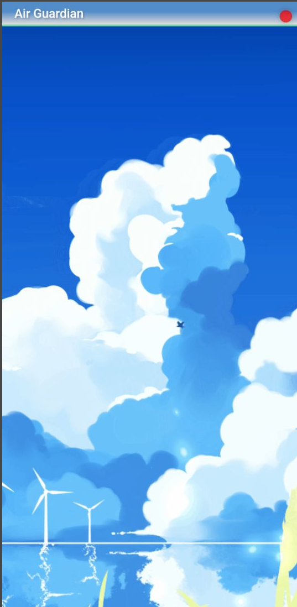
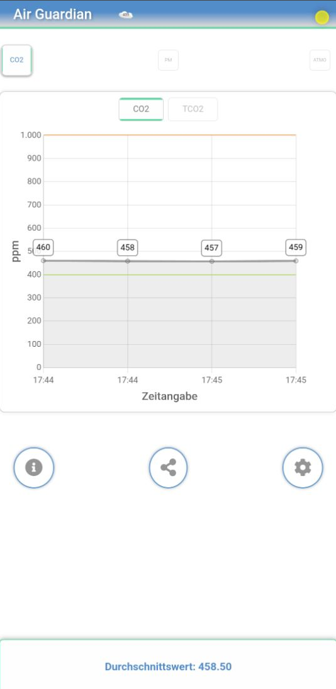

# **AirGuardian (SensIT)**

## **Project Overview**

AirGuardian (SensIT) is an innovative application for monitoring air quality. It provides real-time information on CO2 levels, PM10/PM2.5 values, and other key air quality indicators. With a reactive homepage animation and the ability to export data, AirGuardian is an indispensable tool for those who are environmentally conscious.

## **Screenshots**




## **Technologies**

- **Frontend**: Vue.js
- **Mobile** **Framework**: Ionic Framework with Capacitor
- **State Management**: Vuex
- **Data Visualization**: vue-chart-3
- **Animations**: GSAP/Lottie (WIP)
- **Tutorial**: Shepherd Plugin


## **Installation**
**Prerequisites**

Install Node.js, Ionic, and Vue.js on your system.

**Installation Steps**

- Clone the repository: git clone [Repository URL]
- Navigate to the project directory: `cd AirGuardian`
- Install dependencies: `npm install`
- Start the app: ```ionic serve```


## **Mobile Installation and Testing**
**Prerequisites for Mobile**

Install the Ionic CLI and Capacitor globally: `npm install -g ionic capacitor`.
Set up a development environment for Android/iOS.

**Installation and Testing on Mobile Devices**

- Add the platform (iOS/Android): `ionic capacitor add ios` or `ionic capacitor add android`
- Build the app for the specific platform: `ionic capacitor build ios` or `ionic capacitor build android`
- Open the platform-specific project in Xcode (for iOS) or Android Studio (for Android) and run on a device or emulator.
